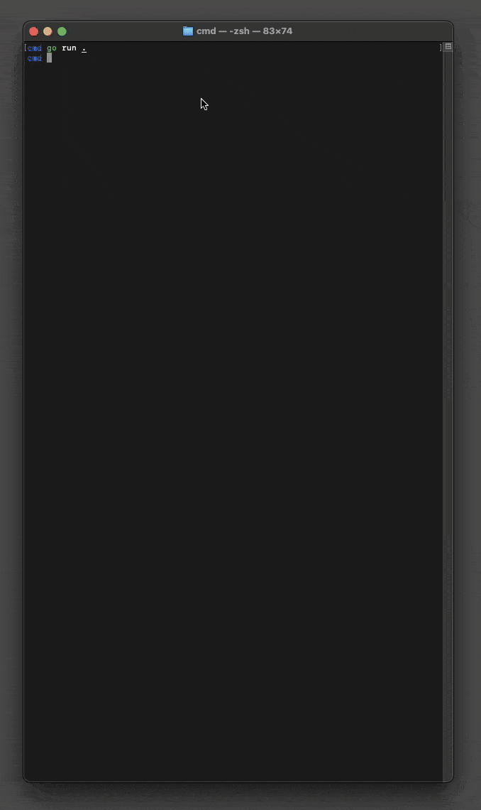

# scrcpy-go

`scrcpy-go` is a simple, lightweight Go client/wrapper for [scrcpy 1.20](https://github.com/Genymobile/scrcpy/tree/v1.20).  
It supports sending control commands and receiving H.264 video stream from Android devices.

## Features

- Written in pure Go
- Supports the following control commands:
  - **Inject Keycode** — send hardware key events (e.g. volume, back)
  - **Inject Text** — input text as if typed from a keyboard
  - **Inject Touch Event** — emulate tap, swipe, and multitouch gestures
  - **Inject Scroll Event** — emulate scroll gestures
  - **Back or Screen On** — trigger back button or turn on screen
  - **Expand Notification Panel** — open notification drawer
  - **Expand Settings Panel** — open quick settings drawer
  - **Collapse Panels** — close any open system panels
  - **Get Clipboard** — retrieve device clipboard content
  - **Set Clipboard** — copy text to device clipboard
  - **Set Screen Power Mode** — turn screen on/off
  - **Rotate Device** — request device to rotate screen

- Decodes and displays H.264 video stream
- Connects via TCP to the scrcpy server running on the Android device

## Usage

A basic terminal UI demo is available in the [`cmd/`](./cmd) directory.  
It mirrors the screen and allows input using the keyboard and mouse.

> **Note:** FFmpeg is required for video decoding.  
> Make sure `ffmpeg` is installed and available in your `PATH`.

### Screenshot

<!-- Add your screenshot here -->


### Example

```bash
go run ./cmd
````

## Requirements

* Android device with scrcpy server (version 1.20) running
* `ffmpeg` installed
* Go 1.20+

## License

MIT